# Social Complaint Box

A small website for reporting problems in your area and following them until they get fixed. Think broken roads, garbage that never gets picked up, a scam call you want to warn people about.

This started as a college group project. Here I've rebuilt it as a front-end demo so anyone can click around without installing anything. It runs completely in the browser with sample data, so nothing you do is saved and it all resets when you refresh.

**Live demo:** [https://himangshu205.github.io/social-complaint-box-demo/](https://himangshu205.github.io/Social-complaint-box-Updated--DEMO/)

**Want to see the admin side?** Click "Try the admin side" in the yellow bar at the top. The login is already filled in (`admin@example.com` / `demo123`).

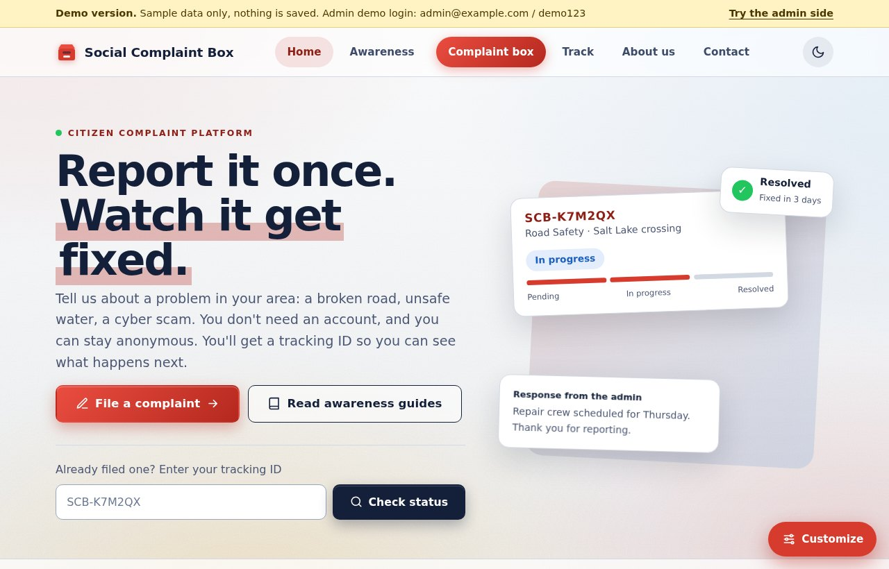

## What it does

**If you're reporting something**
- Pick a category, say how urgent it is, add where it is (or drop a location pin), and attach up to three photos
- Not sure what to write? Tap a quick-start example and edit the blanks
- Turn on anonymous mode if you don't want to give a name or email
- You get a tracking ID back, which you can use to check the status and read the admin's reply
- Once something is marked resolved, you can say whether it was really fixed. If it wasn't, it gets reopened
- There are awareness guides too: search them, filter by topic, save the ones you like with the heart, and switch between grid and list view

**If you're the admin**
- A dashboard with the numbers: how many complaints, how many are still open, how urgent they are
- Search, filter and sort complaints, or tick a few and change their status in one go
- Reply publicly to the person who reported it, and leave a private note that only admins see
- Export the list as a CSV file
- Add, edit and delete the awareness guides, read messages, change the password

**Make it look different**
There's a Customize button in the corner. You can switch between light and dark, pick an accent colour, change the background style, try a different font, and make the corners sharp or round. It remembers what you picked.

## Screenshots

| | |
|---|---|
| **Quick actions and topic shortcuts** <br> 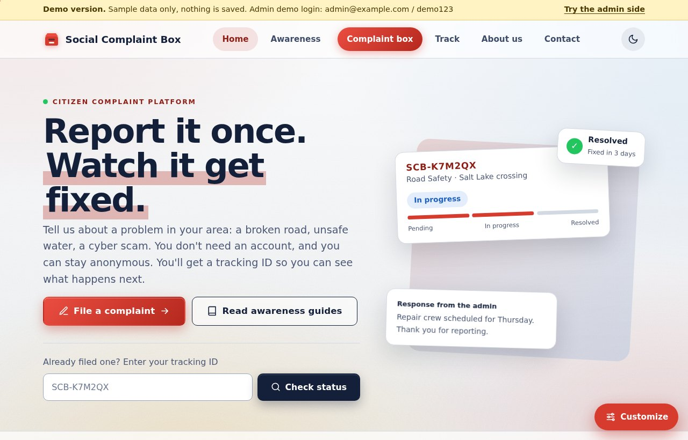 | **Awareness guides** <br> 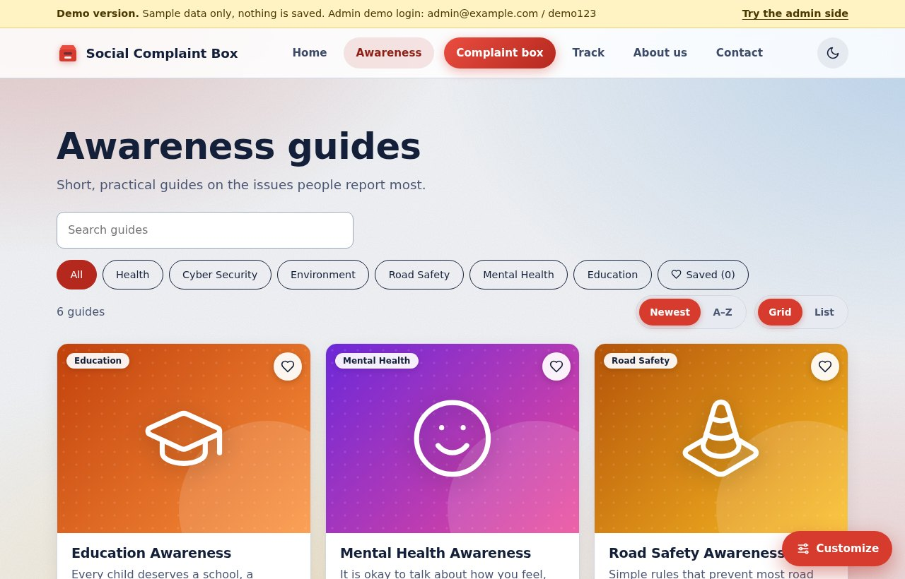 |
| **Filing a complaint** <br> 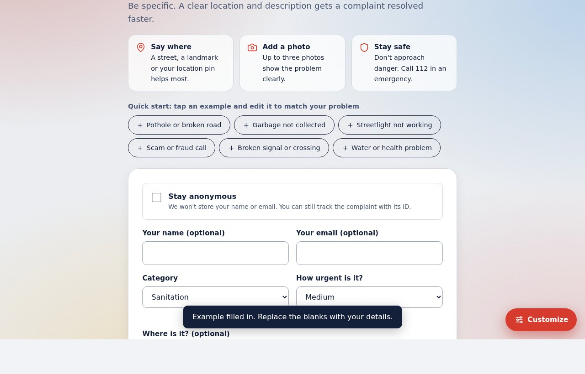 | **Tracking a complaint** <br> 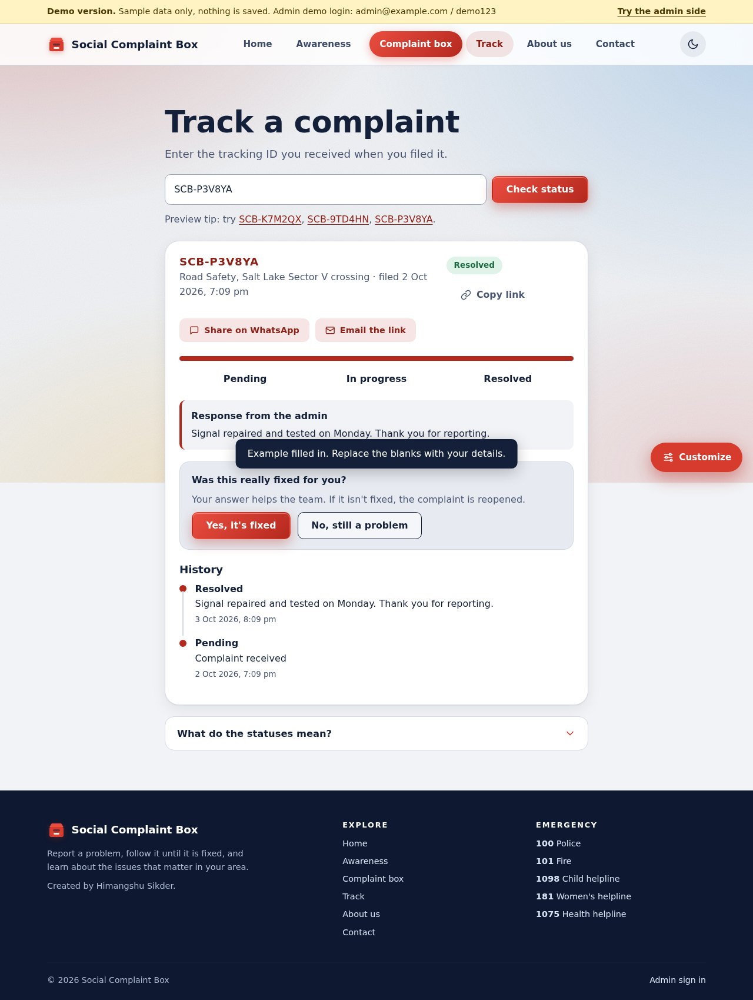 |
| **The Customize panel** <br> 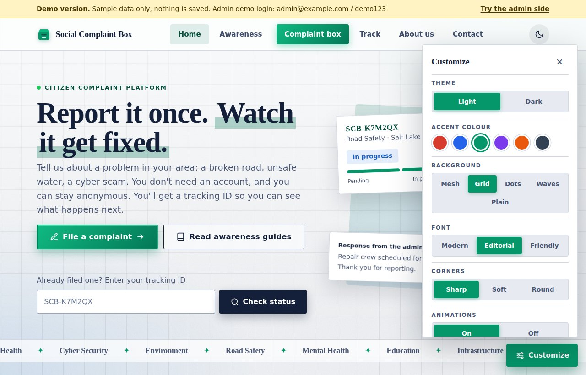 | **Dark theme** <br> 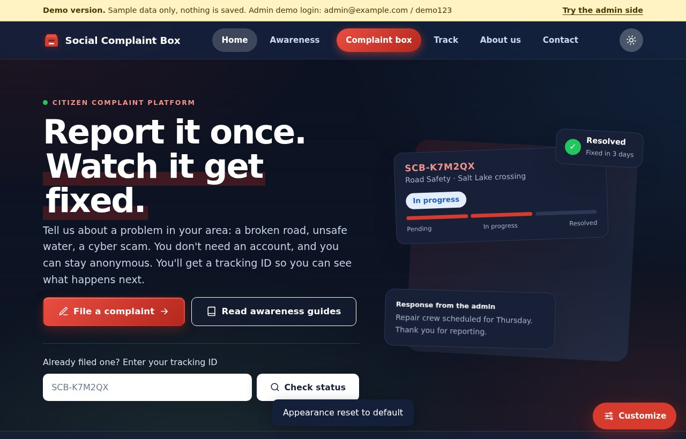 |
| **Admin dashboard** <br> 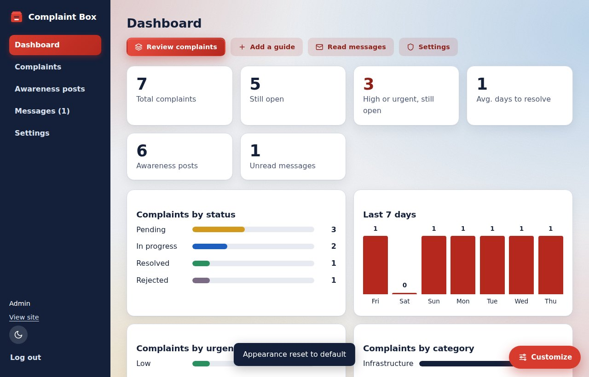 | **Admin complaints list** <br> 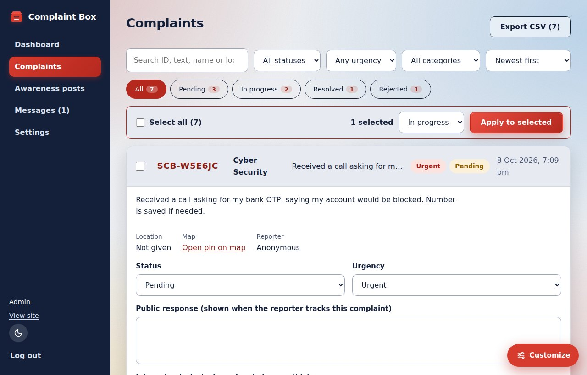 |
| **On a phone** <br> 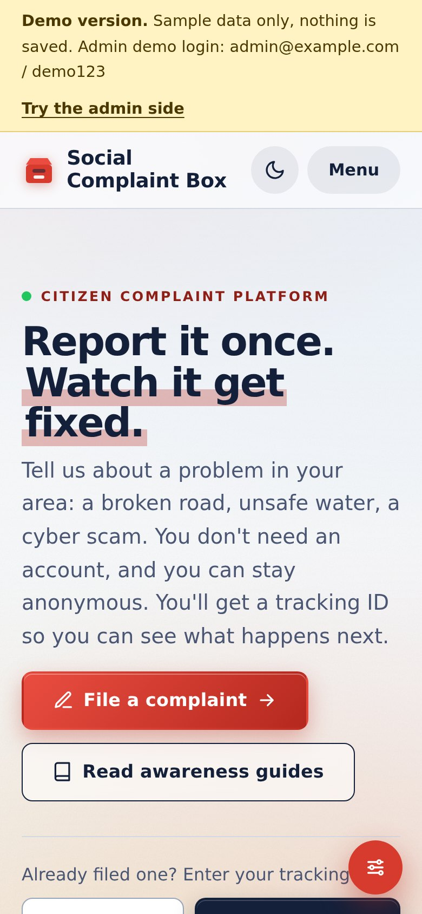 | **Phone menu** <br> 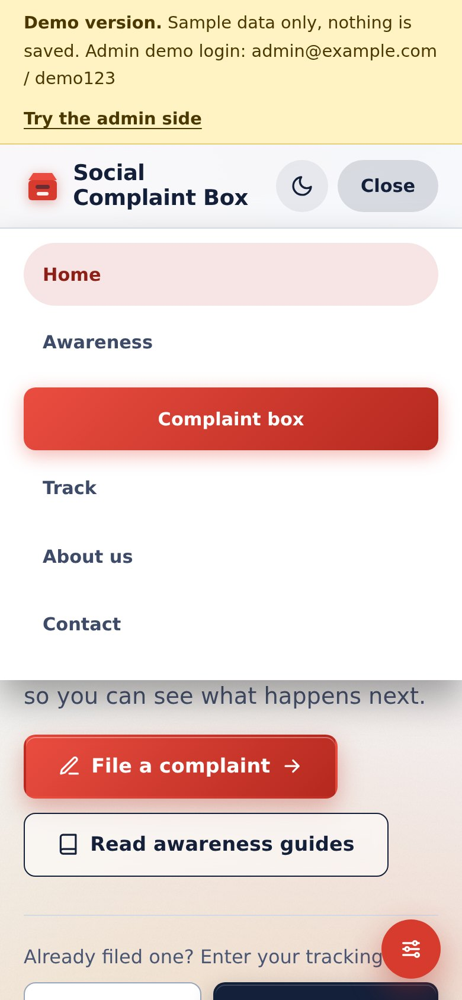 |

## How it's built

Just HTML, CSS and JavaScript. No frameworks, no Tailwind and no build step, so you can open `index.html` and it works.

A few things that might be useful if you're reading the code:
- Each page is a JavaScript function that returns HTML. The part of the address after `#` (like `#/track/SCB-K7M2QX`) decides which page shows.
- The Customize options are stored as `data-` attributes on the page and the CSS reacts to them using variables. That's how one click can change the accent colour everywhere.
- All the sample complaints, guides and messages live in `js/state.js`. Everything is kept in memory.
- The original group project used Node.js, Express and MongoDB. This demo doesn't, which is why nothing is stored.

## Folder layout

```
index.html            the one page everything loads into
css/
  base.css            reset, typography, layout, buttons, forms, cards
  modern.css          header and button polish, hero, loading placeholders, 404 page
  features.css        urgency badges, bulk actions, location button, print styles
  theme.css           accent colours, fonts, corners, backgrounds, Customize panel
  components.css      quick actions, FAQ, feature cards, call-to-action, save hearts
  demo.css            the yellow demo banner
js/
  utils.js            small helpers and shared lists (categories, statuses, urgency levels)
  appearance.js       theme, accent, font, corner and animation settings
  icons.js            icons and the category tiles
  content.js          FAQ text, example complaints, contact topics
  effects.js          scroll fade-in, loading placeholders, animated counters
  state.js            sample data and page state
  components.js       toasts, guide popup, badges, guide cards and filtering
  pages-public.js     home, awareness, file a complaint, track, about, contact, 404
  pages-admin.js      login, dashboard, complaints, guides, messages, settings
  router.js           which page to show, and page titles
  panel.js            Customize panel, back-to-top, scroll progress bar, button ripple
  events.js           clicks, typing and form submits
  main.js             starts everything
assets/
  favicon.svg         the little icon in the browser tab
screenshots/          the pictures in this README
```

Made by Himangshu Sikder.
